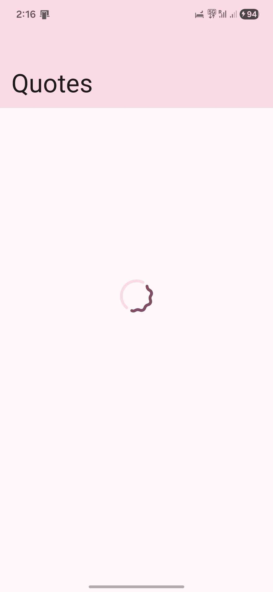
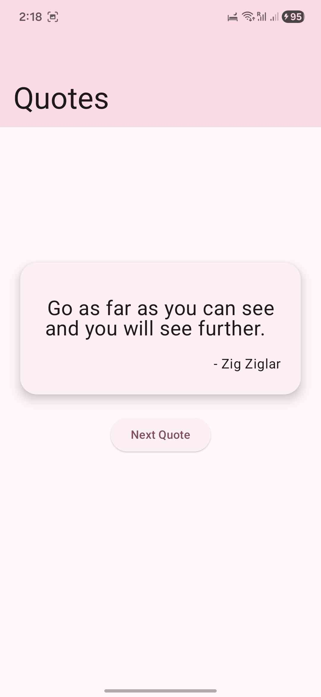
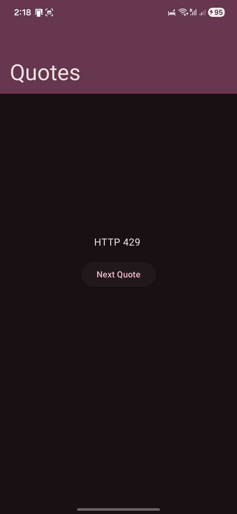
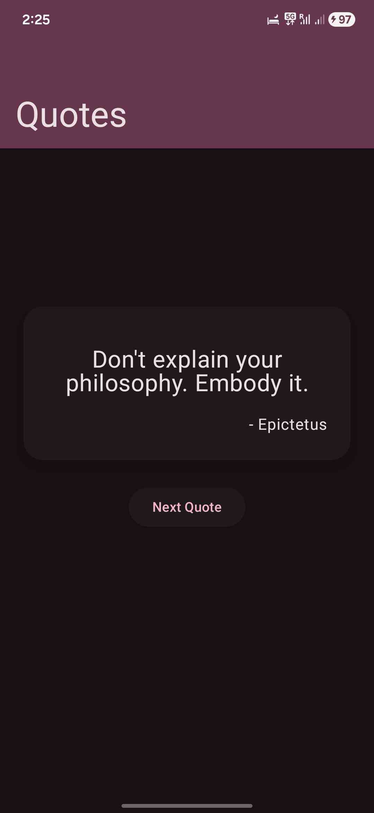
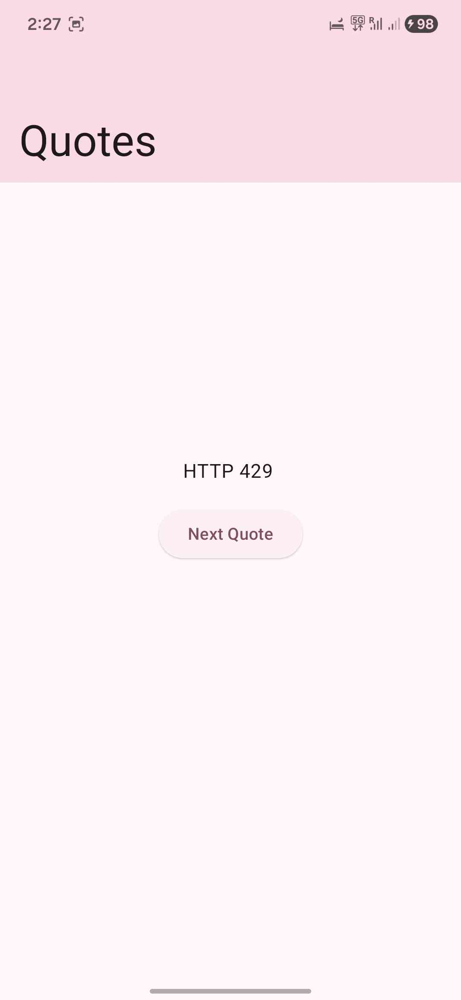

# Quotes App

A simple Android app that displays random quotes using the [ZenQuotes API](https://zenquotes.io/).

## Screenshots

| | | 
| :---: | :---: |
|  |  |
|  |  |
|  |  |

## Features

*   Fetches and displays a random quote.
*   Built with modern Android development tools.

## Tech Stack

*   [Kotlin](https://kotlinlang.org/)
*   [Jetpack Compose](https://developer.android.com/jetpack/compose)
*   [Retrofit](https://square.github.io/retrofit/)
*   [Kotlinx Serialization](https://github.com/Kotlin/kotlinx.serialization)

## Setup

1.  Clone the repository.
2.  Open the project in Android Studio.
3.  Build and run the app.

## Download

You can download the latest version of the app from the [GitHub Releases](https://github.com/KaiParker21/Quotes/releases) page.