# Quotes

A modern Android app that delivers curated inspirational quotes with a clean,
context-aware UI and home screen widget support.

Powered by the ZenQuotes API.

---

## ✨ Features

- Fetch and display random quotes
- Quote of the Day section
- Rate limit handling with countdown state
- Context-aware error theming
- Collapsing LargeTopAppBar
- Home screen widget (refreshable)
- Dark mode support
- Material 3 design

---

## 🖼 Screenshots

### 📱 Widget

| Light | Dark |
| :---: | :---: |
| 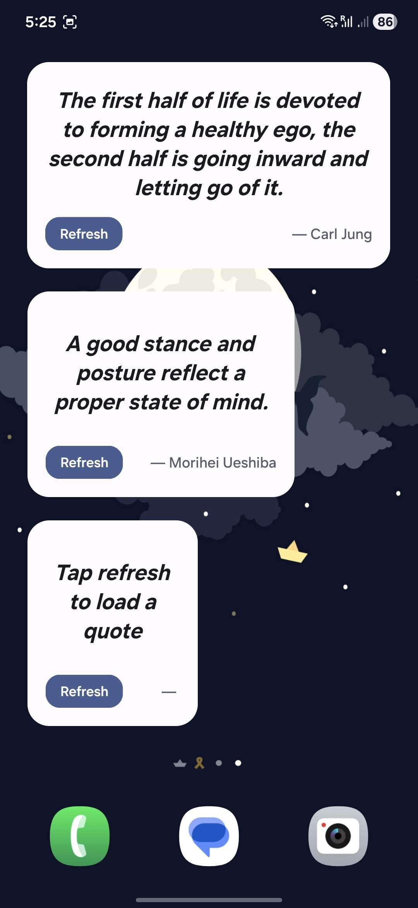 | 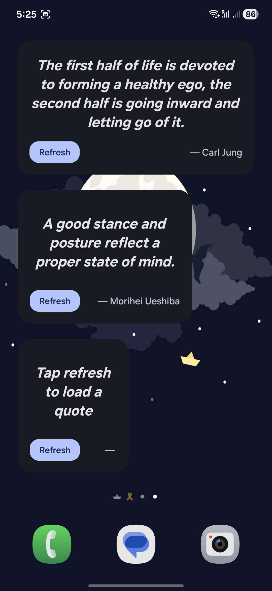 |

---

### 🌞 Light & 🌙 Dark Mode

| Light | Dark |
| :---: | :---: |
| 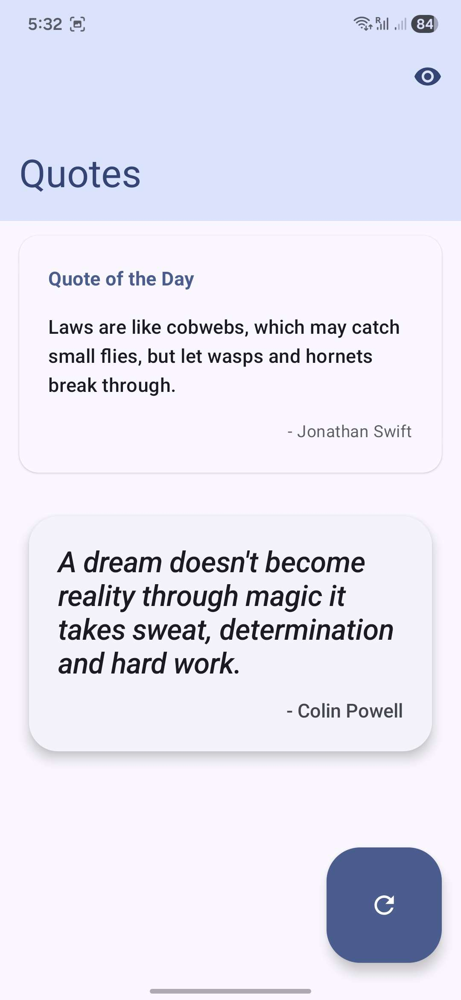 | 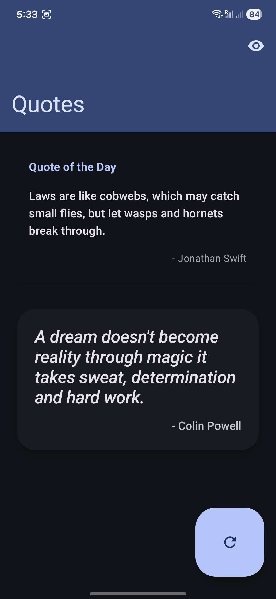 |
| 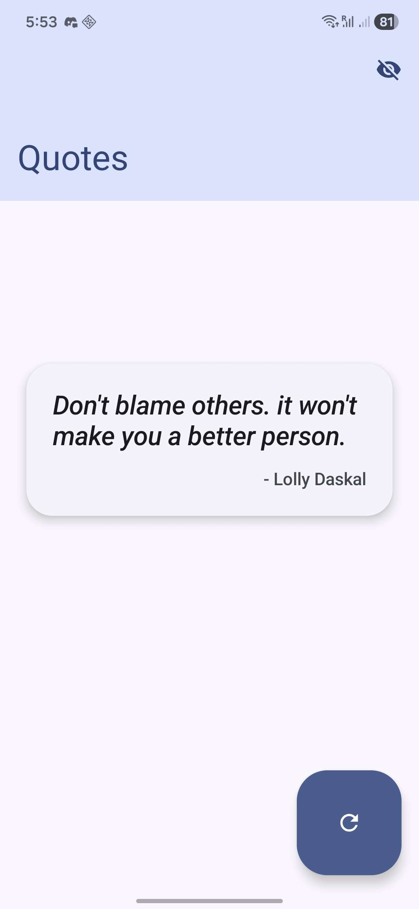 | 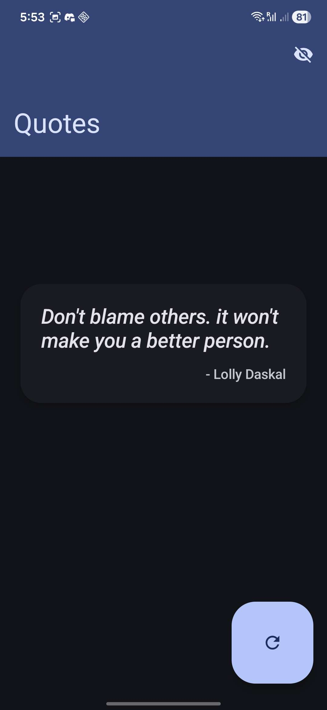 |
| 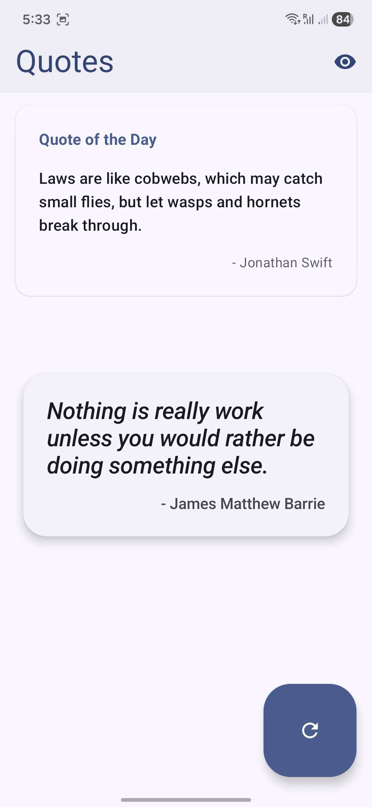 | 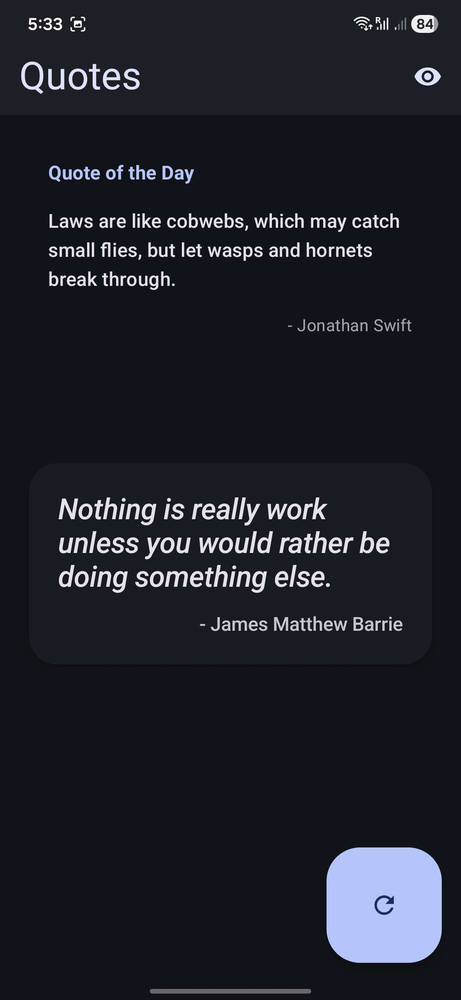 |
| 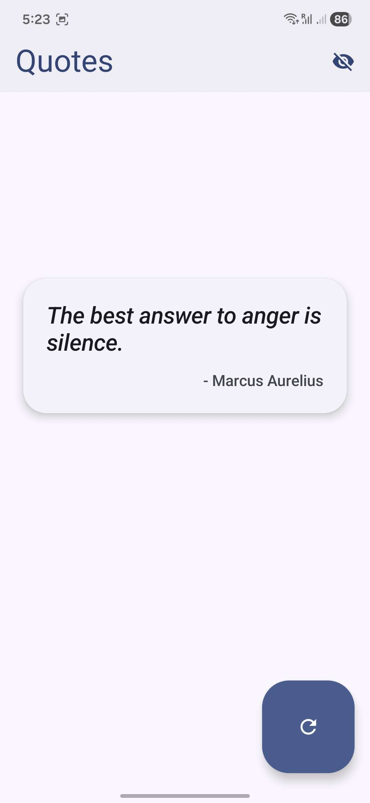 | 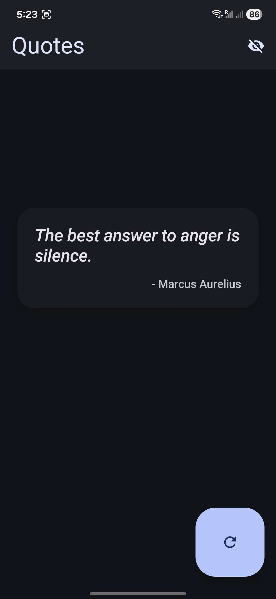 |
| 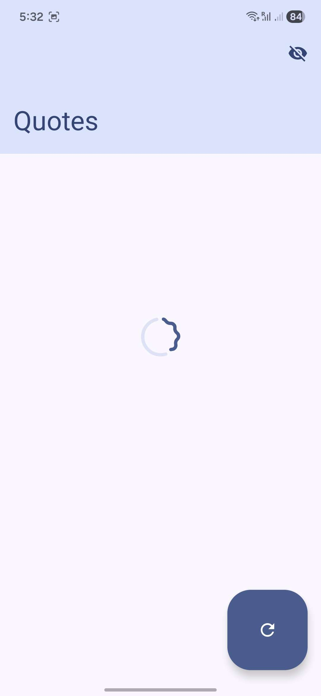 | 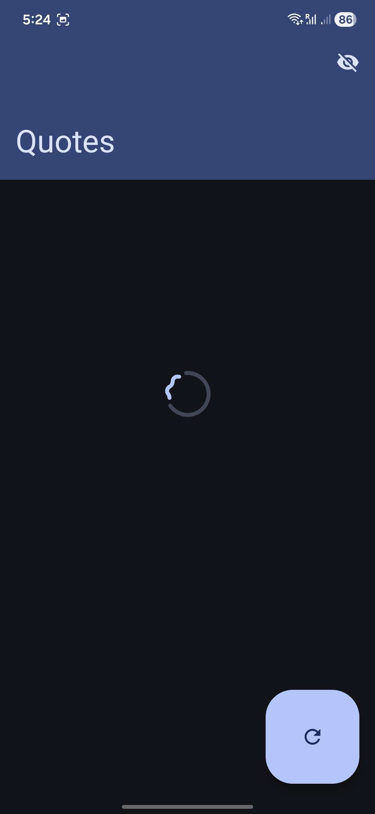 |
| 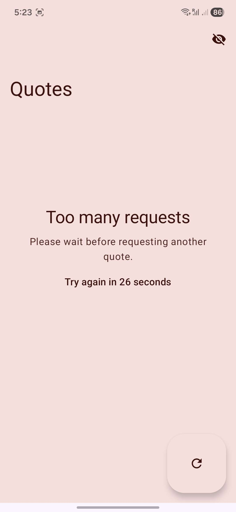 | 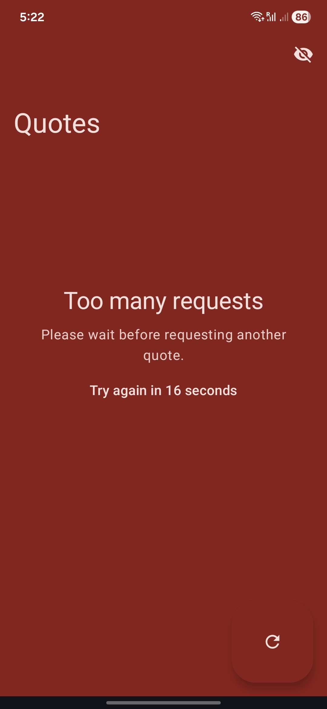 |
| 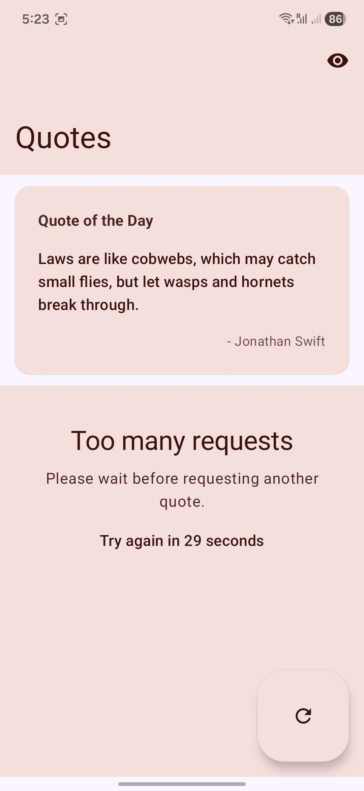 | 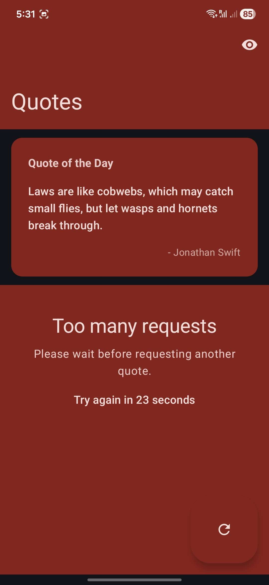 |
| 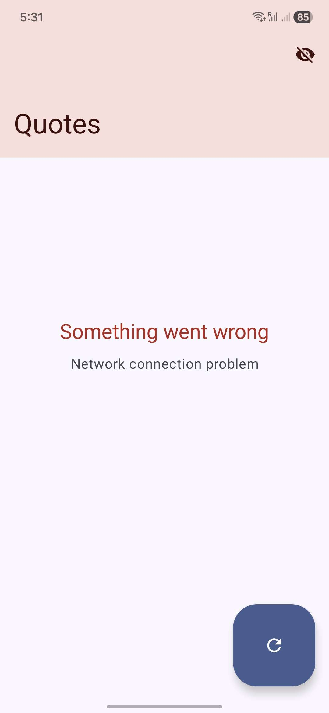 |  |

---

## 🧱 Architecture

- MVVM architecture
- Single source of truth UI state
- Sealed class UI state management
- Repository pattern
- Manual dependency injection

---

## 🛠 Tech Stack

- Kotlin
- Jetpack Compose (Material 3)
- Retrofit
- Kotlinx Serialization
- Glance (App Widgets)

---

## 🚀 Setup

1. Clone the repository
2. Open in Android Studio
3. Build and run

---

## 📦 Download

Latest APK available on the Releases page:  
https://github.com/KaiParker21/Quotes/releases

---

## 📜 Changelog

### v1.1.0 – Widget Support & UI Refinement

- Added home screen widget with refresh functionality
- Implemented Quote of the Day section
- Added rate limit handling with countdown UI
- Context-aware error theming
- Large collapsing TopAppBar
- Improved dark mode tonal layering
- Refined typography hierarchy
- Layout and spacing refinements

---

### v1.0.0 – Initial Release

- Fetch and display random quotes
- Basic Material 3 UI
- Dark mode support

